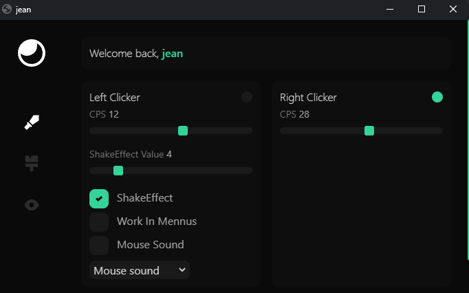

# pants-clicker
Autoclicker/Autoclick (LeftClick/RightClicker) for minecraft made in python and its gui in html, with mouse sound, jitter effect and workinmenus

You need to have python installed on your pc [Download python here](https://www.python.org/downloads/)

### You need to install this packages:

- `pip install pywin32`
- `pip install eel[jinja2]`
- `pip install win32gui`

My discord: jeanclap

Credits to: @B4mb0u
